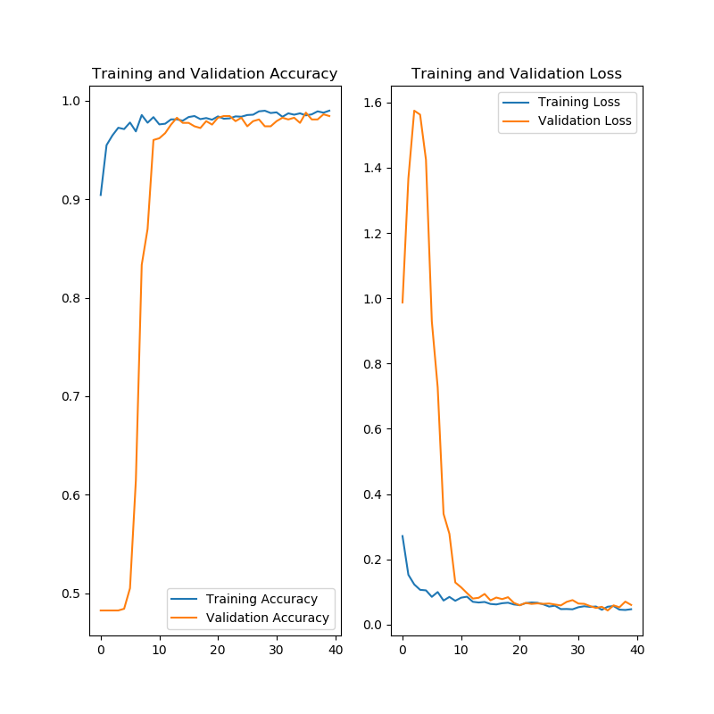

# CrackDetectorDoc

Crack Detection using Machine Learning

# Introduction

**This is work in progress.**

This repository documents the progress on the development of convolutional neural networks (CNNs) to perform crack detection. 

# Data Preparation

The image datasets are obtained from: 
    
    https://drive.google.com/file/d/1kC60RGO3rcScVk7HY-s7tTMJeMbADfh1/view
    
    https://data.mendeley.com/datasets/5y9wdsg2zt/2
    

Input size for images is set at 128 by 128. Note that in the paper above, input images are 256 by 256.

# The Neural Network

The current implemented CNN is based on the paper:

Young-Jin Cha and Wooram Choi - "Deep Learning-Based Crack Damage Detection Using Convolutional Neural Networks"
https://www.researchgate.net/publication/315613676_Deep_Learning-Based_Crack_Damage_Detection_Using_Convolutional_Neural_Networks

   

We test binary cross-entropy and categorical cross-entropy losses. For the former, the CNN resembles that described in the above figure whereas for the latter, layer 7 (L7) is replaced by a single node, and the softmax activation function is replaced by the sigmoid function.

To minimize overfitting, dropout regularization is used between layer 6 (L6) and layer 7 (L6). The dropout rate is set to 0.5.

# Code

The code is in Python using Tensorflow 2.0.

# Performance

We use 3000 training images and 600 validation images. 

We use the Adams solver instead of the Stochastic Gradient Descent described in the paper. The learning rate is set at $2 \times 10^{-5}$

Batch size is set to 64.

The performances of the CNNs are indicated in the figures below. 

*Using binary cross-entropy loss*
   

*Using categorical cross-entropy loss*
   

<!--
Although the loss and accuracy appear good, and overfitting does not appear to be an issue, there are large fluctuations in the loss and accuracy during the validation steps. This might be due to the small size of the current validation dataset (less than 100 images). 
-->

# TODO List

1. Increase number of images in training and validation datasets.

2. Implement a K-fold cross validation procedure.

3. Explore other CNNs such as those described in these papers:

    CRACK500:

        @inproceedings{zhang2016road, title={Road crack detection using deep convolutional neural network}, author={Zhang, Lei and Yang, Fan and Zhang, Yimin Daniel and Zhu, Ying Julie}, booktitle={Image Processing (ICIP), 2016 IEEE International Conference on}, pages={3708--3712}, year={2016}, organization={IEEE} }' .

        @article{yang2019feature, title={Feature Pyramid and Hierarchical Boosting Network for Pavement Crack Detection}, author={Yang, Fan and Zhang, Lei and Yu, Sijia and Prokhorov, Danil and Mei, Xue and Ling, Haibin}, journal={IEEE Transactions on Intelligent Transportation Systems}, year={2019}, publisher={IEEE} }

    GAPs384:

        @inproceedings{eisenbach2017how, title={How to Get Pavement Distress Detection Ready for Deep Learning? A Systematic Approach.}, author={Eisenbach, Markus and Stricker, Ronny and Seichter, Daniel and Amende, Karl and Debes, Klaus and Sesselmann, Maximilian and Ebersbach, Dirk and Stoeckert, Ulrike and Gross, Horst-Michael}, booktitle={International Joint Conference on Neural Networks (IJCNN)}, pages={2039--2047}, year={2017} }

    CFD:

        @article{shi2016automatic, title={Automatic road crack detection using random structured forests}, author={Shi, Yong and Cui, Limeng and Qi, Zhiquan and Meng, Fan and Chen, Zhensong}, journal={IEEE Transactions on Intelligent Transportation Systems}, volume={17}, number={12}, pages={3434--3445}, year={2016}, publisher={IEEE} }

    AEL:

        @article{amhaz2016automatic, title={Automatic Crack Detection on Two-Dimensional Pavement Images: An Algorithm Based on Minimal Path Selection.}, author={Amhaz, Rabih and Chambon, Sylvie and Idier, J{'e}r{^o}me and Baltazart, Vincent} }

    cracktree200:

        @article{zou2012cracktree, title={CrackTree: Automatic crack detection from pavement images}, author={Zou, Qin and Cao, Yu and Li, Qingquan and Mao, Qingzhou and Wang, Song}, journal={Pattern Recognition Letters}, volume={33}, number={3}, pages={227--238}, year={2012}, publisher={Elsevier} }

# References
    
    https://stats.stackexchange.com/questions/345990/why-does-the-loss-accuracy-fluctuate-during-the-training-keras-lstm
    
    https://gombru.github.io/2018/05/23/cross_entropy_loss/
    
    https://stats.stackexchange.com/questions/363592/what-influences-fluctuations-in-validation-accuracy
    
    
    Using K-Fold Cross Validation with Keras (5.2) https://bit.ly/35vtAmY

